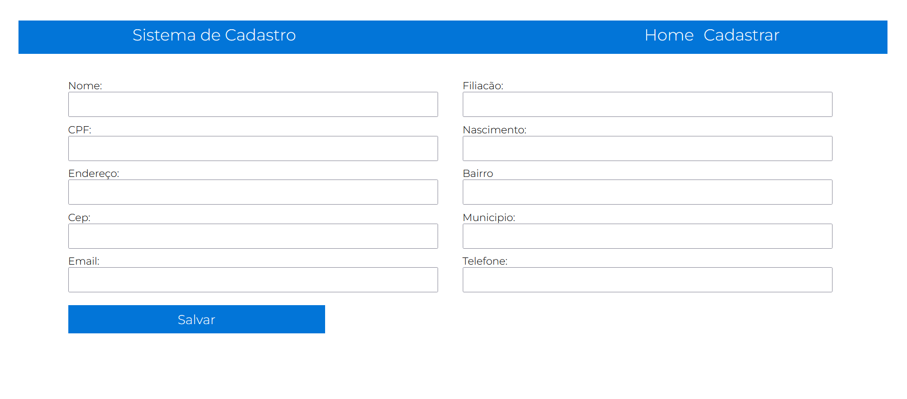

# CRUD de Cadastro de Clientes em PHP e MySQL
Este é um repositório que contém um sistema CRUD (Create, Read, Update, Delete) simples para o cadastro de clientes, implementado em PHP e utilizando um banco de dados MySQL.

## Funcionalidades
-  Cadastro de Clientes: Adicione novos clientes à base de dados, fornecendo informações como nome, endereço, telefone e email.
-  Visualização de Clientes: Visualize a lista de clientes cadastrados com opções de busca e ordenação.
-  Atualização de Informações: Atualize as informações de clientes já existentes.
-  Remoção de Clientes: Exclua registros de clientes quando necessário.

## Estrutura do Projeto:
```html
Raiz do Projeto:
|
├── App/
|    ├── ControllerApp.php
|    └── Model/
|          |
|          ├── App.php
|          └── Conexao.php
|
├── Includes/
|    └── Header.php
|
├── cadastrar.php 
├── editar.php
└── index.php
```

### Código SQL da tabela Cadastro:
```sql
CREATE TABLE `cadastro`(
    `id`INT NOT NULL AUTO_INCREMENT,
    `nome`VARCHAR(50) NOT NULL,
    `filiacao`VARCHAR(50) NOT NULL,
    `cpf`VARCHAR(50) NOT NULL,
    `nascimento`VARCHAR(50) NOT NULL,
    `endereco`VARCHAR(50) NOT NULL,
    `bairro`VARCHAR(50) NOT NULL,
    `cep`VARCHAR(50) NOT NULL,
    `municipio`VARCHAR(50) NOT NULL,
    `email`VARCHAR(50) NOT NULL,
    `tel`VARCHAR(50) NOT NULL,
    PRIMARY KEY (`id`)
) ENGINE = InnoDB;
```

## Contato
Em caso de dúvidas ou sugestões, entre em contato através do email: paulo.rafael.jobs@gmail.com
